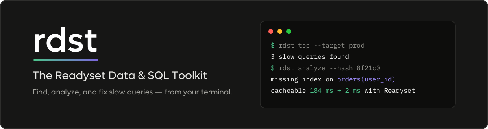

<div align="center">



<p>
  <a href="LICENSE"></a>
  
  
  <a href="https://readyset.io/docs/readyset-ai/rdst/cli"></a>
  <a href="https://readyset.io/downloads"></a>
</p>

**Find slow queries, analyze them, and fix them — from your terminal.**

</div>

RDST is a command-line toolkit for database diagnostics, query analysis,
performance tuning, and caching with [Readyset](https://readyset.io). Point it
at PostgreSQL or MySQL and it finds your slow queries, explains *why* they are
slow, and shows what an index, a rewrite, or a Readyset cache would do about it.

## Highlights

- **`rdst top`** — live view of the slowest queries hitting your database
- **`rdst analyze`** — EXPLAIN-driven analysis with AI index and rewrite recommendations, plus a real Readyset cache benchmark (`--readyset-cache`)
- **`rdst ask`** — ask questions about your data in natural language; guarded, read-only SQL generation
- **`rdst audit` / `rdst fleet`** — deep health audits of one database or a whole fleet
- **`rdst scan`** — find ORM queries (SQLAlchemy, Django, Prisma, Drizzle) in your codebase and flag performance issues, deterministic and CI-friendly
- **`rdst demo`** — try everything against a local demo database in one command
- **MCP built in** — `rdst claude add` registers RDST as an MCP server so Claude Code can use your targets

## Installation

Prefer an app? **[RDST Desktop](https://readyset.io/downloads)** packages the
same toolkit with a graphical client for macOS, Windows, and Linux.

Install the RDST CLI on macOS or Linux without sudo, pip, or a preinstalled Python:

```bash
curl -fsSL https://downloads.readyset.io/packages/rdst-cli/install.sh | sh
```

Open a new shell, then verify the installation:

```bash
rdst version
```

The installer supports Apple silicon, Intel macOS, and glibc-based x86_64 or
arm64 Linux distributions. To install an exact package release:

```bash
curl -fsSL https://downloads.readyset.io/packages/rdst-cli/install.sh | \
  sh -s -- --version 0.1.1589
```

Immutable release scripts and checksums are published under
`packages/rdst-cli/versions/VERSION/` on the download origin.

Installer-managed RDST never updates silently. Check for and install updates explicitly:

```bash
rdst update --check
rdst update
```

`rdst update` installs the exact resolved release and makes no changes when the
installed version is already current.

To uninstall the managed runtime while preserving `~/.rdst` configuration:

```bash
curl -fsSL https://downloads.readyset.io/packages/rdst-cli/install.sh | \
  sh -s -- --uninstall
```

Existing uv and pipx users can continue to use `uv tool install rdst` or
`pipx install rdst`; those installations remain managed by their package manager.
Update them with `uv tool upgrade rdst` or `pipx upgrade rdst`.

> **After installing**, run `rdst init` to configure your first database connection.

### Native Windows development

Use PowerShell with Python 3.12+ and uv:

```powershell
cd rdst
uv sync --group dev
uv run rdst version
$env:PROD_DB_PASSWORD = "your-password"
```

RDST stores user data under `%USERPROFILE%\.rdst`. Interactive editor commands
use `EDITOR` or `VISUAL` and fall back to Notepad.

When the Docker CLI talks to a daemon on another machine, configure the daemon
network explicitly:

```powershell
$env:RDST_DOCKER_REMOTE = "1"
$env:RDST_DOCKER_PUBLISHED_HOST = "192.168.122.1"
$env:RDST_DOCKER_UPSTREAM_HOST = "192.168.122.222"
```

`RDST_DOCKER_PUBLISHED_HOST` is where Windows reaches published container ports.
`RDST_DOCKER_UPSTREAM_HOST` is where containers reach a database running on the
Windows client. The database must listen on that routable address.

## Quick start

1. **Initialize RDST** — the wizard walks you through your first target:
   ```bash
   rdst init
   ```

2. **Or configure a database target directly:**
   ```bash
   rdst configure add --target mydb \
     --host db.example.com \
     --port 5432 \
     --database myapp \
     --user postgres \
     --password-env MYDB_PASSWORD
   ```
   Passwords are never stored in config files — RDST reads them from the
   environment variable you name, or the OS keychain.

3. **Watch what's slow:**
   ```bash
   rdst top --target mydb
   ```

4. **Analyze a query:**
   ```bash
   rdst analyze -q "SELECT * FROM users WHERE active = true" --target mydb

   # Verify with a temporary Readyset performance test
   rdst analyze -q "SELECT * FROM products ORDER BY created_at" --readyset-cache
   ```

5. **Audit health** — one target or the whole fleet:
   ```bash
   rdst audit --target mydb
   rdst fleet audit --target prod
   ```
   See the [fleet audit docs](https://readyset.io/docs/readyset-ai/rdst/fleet-and-audit/fleet-audit).

No database handy? `rdst demo setup` starts a local demo database to explore with.

## Commands

| Command | Description |
| --- | --- |
| `rdst top` | Monitor slow queries in real time |
| `rdst analyze` | Analyze SQL query performance and caching opportunities |
| `rdst ask` | Ask questions about your database in natural language |
| `rdst agent` | Manage and run data agents with safety policies |
| `rdst init` | First-time setup wizard |
| `rdst configure` | Manage database targets and connection profiles |
| `rdst tunnel` | List, close, and test SSH tunnels |
| `rdst schema` | Manage the semantic layer that improves SQL generation |
| `rdst query` | Manage the saved-query registry |
| `rdst guard` | Manage reusable safety policies |
| `rdst audit` | Run a deep health audit of a database target |
| `rdst fleet` | Manage and audit database fleets |
| `rdst scan` | Scan a codebase for ORM queries (experimental) |
| `rdst demo` | Try RDST with a demo database |
| `rdst claude` | Register RDST with Claude Code (MCP) |
| `rdst slack` | Deploy a Slack bot for database queries |
| `rdst web` | Start the RDST web server and client |
| `rdst report` | Submit feedback or bug reports |
| `rdst help` | Show help, or answer a question (`rdst help "..."`) |
| `rdst update` | Check for and install RDST updates |
| `rdst version` | Show version information |

Run `rdst <command> --help` for options and examples.

AI-assisted commands (`ask`, `analyze` insights, `schema annotate`) use your
`ANTHROPIC_API_KEY`, or a free trial you can start with `rdst configure llm`.

## Requirements

- Packaged CLI: macOS or a glibc-based Linux distribution on x86_64 or arm64
- Native Windows development: Python 3.12+, uv, and PowerShell
- `curl` or `wget` for the macOS/Linux installer
- PostgreSQL or MySQL database access

## About Readyset

Readyset is a SQL caching engine that sits between your application and your
database, keeping query results up to date as the underlying data changes.
Learn more at [readyset.io](https://readyset.io).

## Documentation and support

- [RDST Documentation](https://readyset.io/docs/readyset-ai/rdst/cli)
- [Download RDST Desktop](https://readyset.io/downloads)
- [Report Issues](https://github.com/readysettech/rdst/issues)
- [Security policy](SECURITY.md)

## License

MIT License — see [LICENSE](LICENSE) for details.
